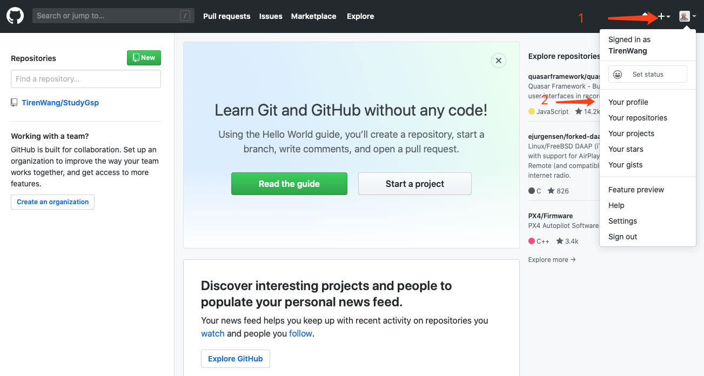
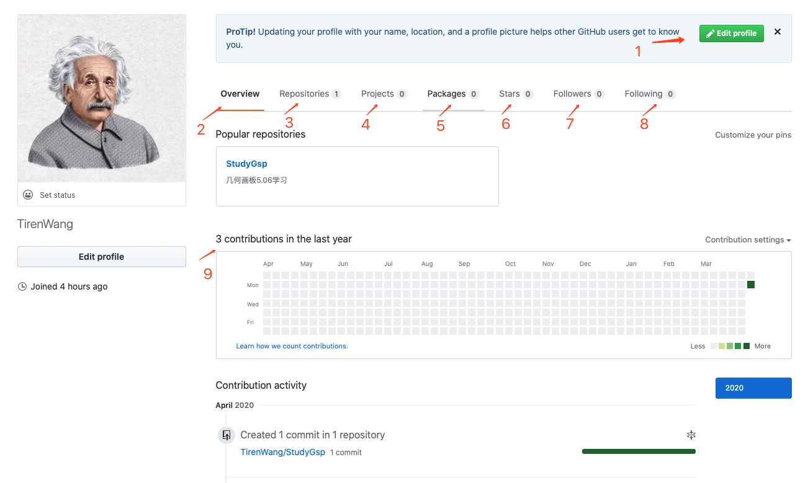
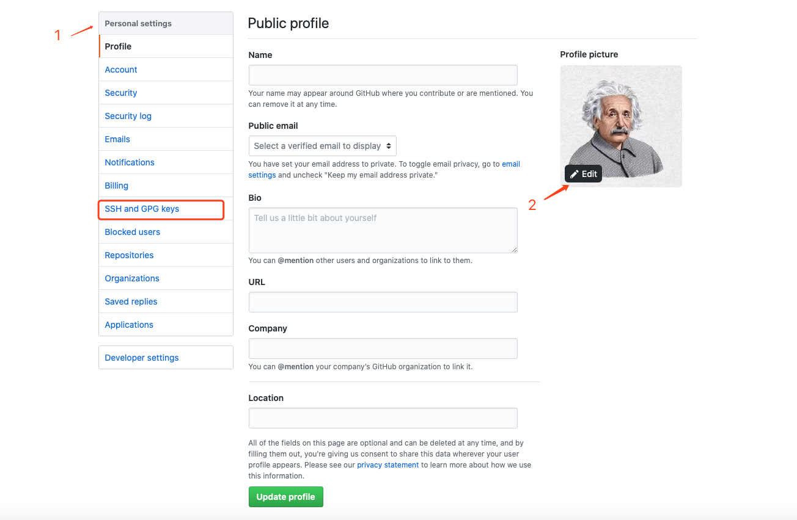
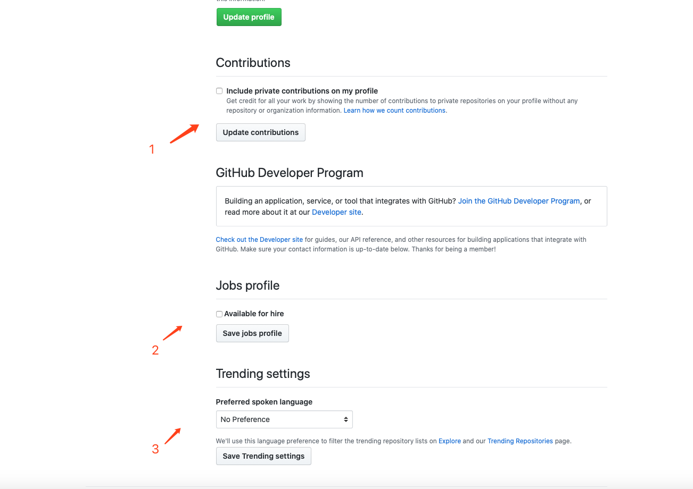

接着「敲开 GitHub 的大门之注册账号」一文的内容，我们继续往下介绍：

标注 1：View profile and more，更多选项视图；
标注 2：Your profile，个人简介。
如上图所在，我们依次点击 标注 1 所示的View profile and more和 标注 2 所示的Your profile，进入「个人简介」界面：

标注 1：Edit profile，修改个人简介；
标注 2：Overview，个人主页概览；
标注 3：Repositories，仓库；
标注 4：**Projects，项目板；(New)**
标注 5：**Packages，压缩包；(New)**
标注 6：Star，点星记录；
标注 7：Followers，粉丝；
标注 8：Following，关注的 GitHub 账号；
标注 9：个人贡献历史记录。

如上图所示，标注 1 表示的为Edit profile，这个选项当我们修改完个人信息之后，就会自动消失；标注 2 表示的为Overview，展示了我们账号的主要内容，包括仓库和贡献等；标记 3 表示的为Repositories，是我们建立的仓库，包括Fork来的项目，GitHub 也会自动为我们创建一个仓库；标记 4 表示的为Projects是项目管理神器，可以帮助组织工作、排列工作的优先级，可以为特定功能工作、全面的路线图甚至发布检查列表；标记 6表示为Star，收藏了我们的“点星”，或者说是“点赞”过的项目；标注 9表示的为我们最近一年来的contribution，用实心的小方格标记，小方格的颜色越深，表示我们的contribution越多。

标注 3 Repositories：仓库就像项目的文件夹。 项目的仓库包含项目的所有文件，并存储每个文件的修订记录。 您也可以在仓库中讨论并管理项目的工作。您可以个人拥有仓库，也可以与组织中的其他人共享仓库的所有权。

标注 4 Projects：GitHub上的项目板可以帮助组织工作和排列工作的优先级，可以为特定功能工作、全面的路线图甚至发布检查列表创建项目板。通过项目板可以灵活地创建适合需求的自定义工作流程。项目板包括议题、拉取请求和注释，在选择的列中分类为卡片，可以拖放或使用键盘快捷键对列中的卡片重新排序，在不同列之间移动卡片，以及更改列的顺序。

在这里，我们点击Edit profile，编辑个人简历：

所示，我们可以通过这个界面填写个人信息，包括 Name（昵称）、Bio（自我介绍）、URL（链接）、Company（公司）、Location（位置）以及 Upload new picture（上传头像）等等。在我们填写完个人信息之后，可以点击Update profile更新个人简介，同时可以勾选Available for hire，选择“雇主可见”，然后点击Save jobs profile，保存我们的求职简历。

此外，在Personal settings中，还包含很多其他的选择，如在Account中，可以修改账号密码；在Emails中，可以修改绑定的邮箱等等。在这里，用红色框圈起的SSH and GPG keys非常重要，我们可以通过它连接到本地的 IDE，从而保证项目提交与检出的安全性。

接下来，展示一下我们刚刚修改完的 GitHub 账号主页：

最后，附上博主的 GitHub 账号，欢迎大家 Follow：：[Tiren Wang](https://github.com/TirenWang)

------------------------------------------------

