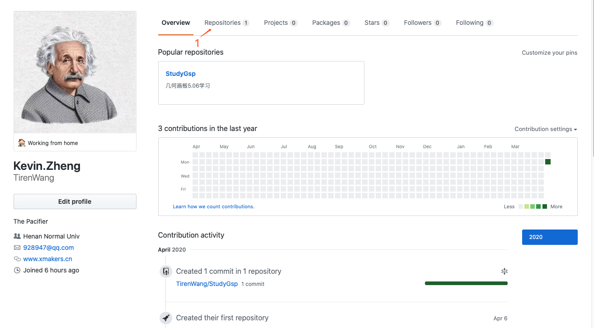
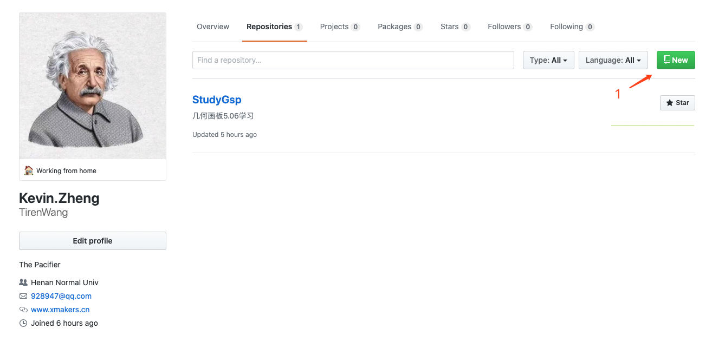
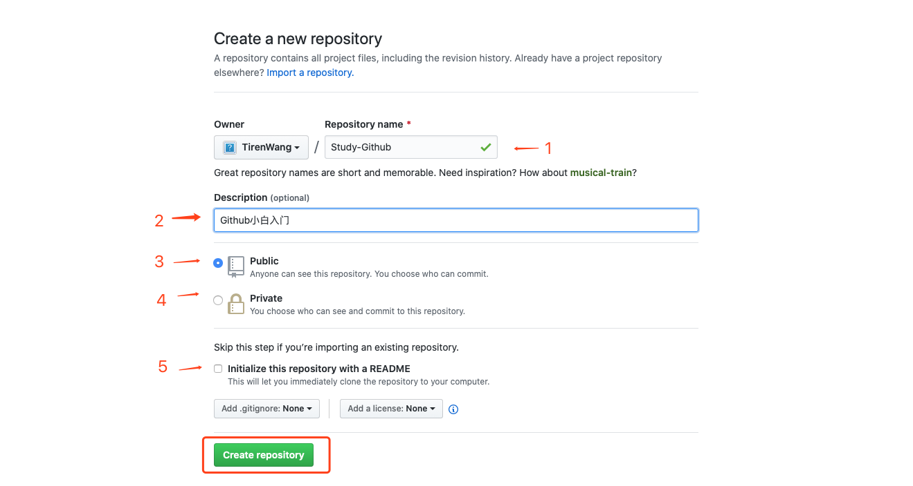
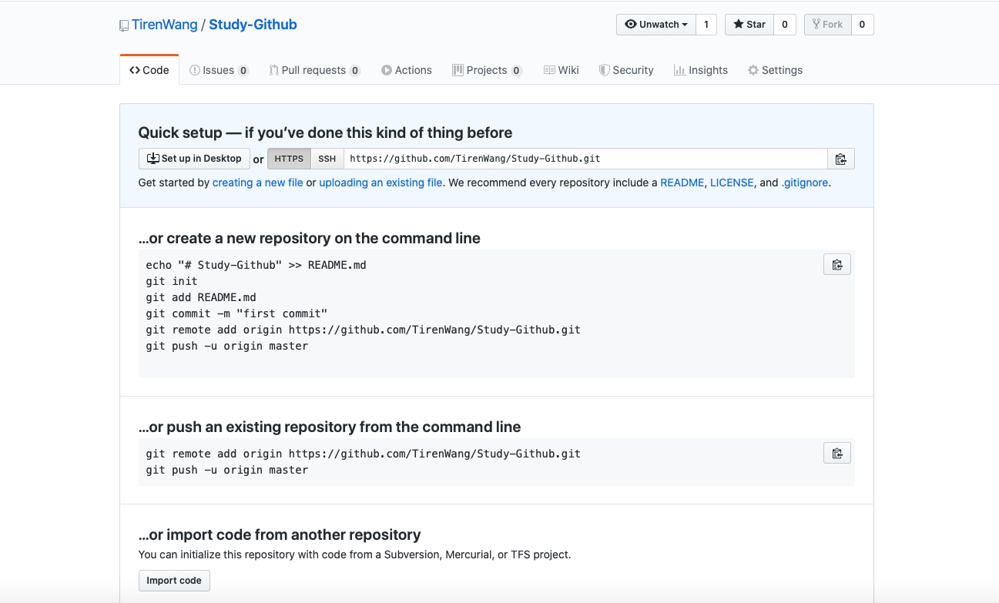

在「GitHub 主页介绍及修改个人信息」一文中，我们已经对 GitHub 的个人主页有了一些了解，并且完成了对个人信息的修改。我们一起来建立自己的Repo吧，也就是 GitHub 的核心要素——库，接下来，我们就尝试创建自己的 GitHub 仓库。

如上图所示，此为博主的 GitHub 个人主页，点击标注1所示的Repositories，进入如下界面：

点击上图标注1所示的绿色New按钮，进入下一步：

标注 1：Repository name，仓库名称；
标注 2：Description，可选描述，也就是写不写都可以；
标注 3：Public，默认的仓库类型；
标注 4：Private，默认的仓库类型；
标注 5：Initialize this repository with a README，初始化仓库的信息文件，建议勾选。
如上图所示，这是创建 GitHub 仓库的核心页面，里面包含了众多信息。为了方便演示，已经把各种所需的信息都填写完啦！接下来，点击矩形标注的绿色Create repository按钮即可：

如上图所示，我们已经把仓库创建成功啦！仓库名为springmvc-tutorial，包含 1 个commit，也就是我们通过勾选Initialize this repository with a README，创建了一个初始化提交文件README.md，其中文件后缀为.md，表示文件为 Markdown 格式；包含 1 个branch，为master分支，即主分支；包含 1 个contributor，为贡献者，也就是我们自己。

标注 1：Popular repositories，受欢迎的仓库，以Star数为依据，依次展示个人项目中Star数前 6 的项目；
标注 2：Contribution，贡献标记，贡献越多，小方块的颜色越深；
标注 3：Contribution activity，贡献活动记录，展示了我们的活动记录。
如上图所示，这是我们创建了仓库之后主页的变化，显然比较之前主页的元素丰富了很多，看着更爽啦！

最后，附上博主的 GitHub 账号，欢迎大家 Follow：[Tiren Wang](https://github.com/TirenWang)

------------------------------------------------------------------------------------------------

