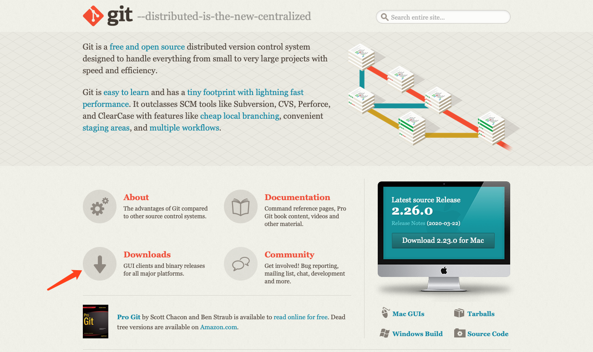
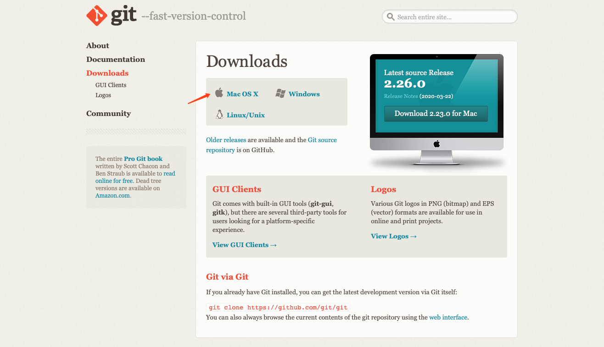
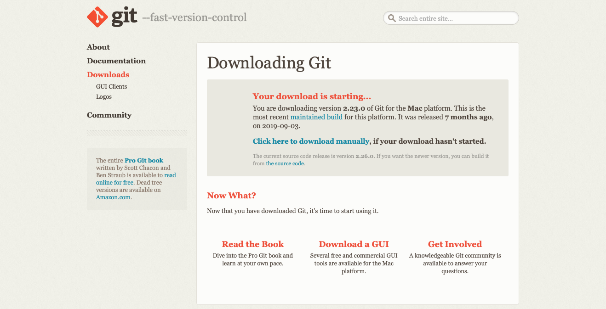
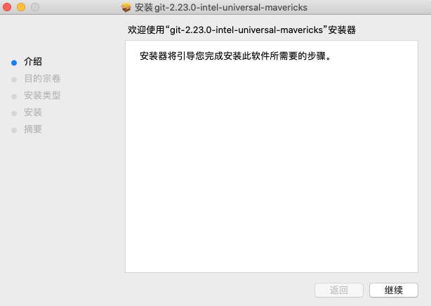
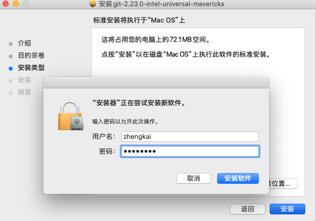
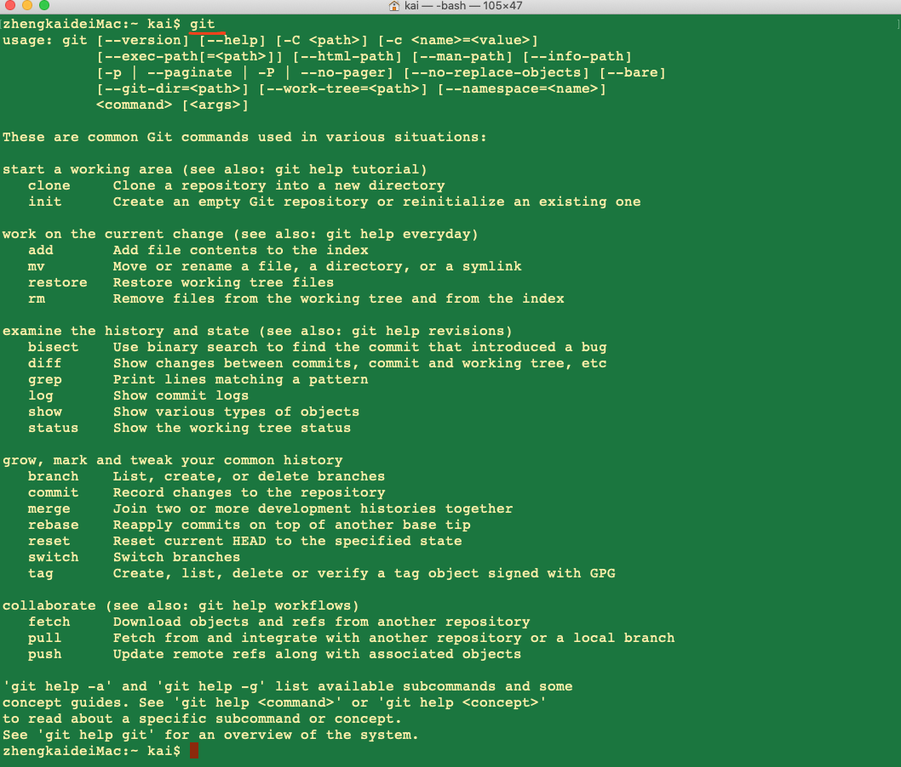

在之前的「揭开Github的神秘面纱」中，我们已经知道了如何创建 GitHub 账号、创建仓库、进行个性化设置等等，但是我们还要知道：GitHub 是基于版本控制系统 Git 之上的啊！如果我们想要进行代码托管，想要进行团队协作，这都少不了一个工具，那就是：Git. 因此，在本篇们就一起来了解一下 Git 的安装流程及步骤。

首先，进入 Git 的官网：[git --everything-is-local](https://git-scm.com/)

如上图所示，在 Git 的官网中点击Downloads，进入如下页面：

如上图所示，选择对应的操作系统，以博主为例，点击Mac OS X，进入如下页面：

如上图所示，正常情况下，会自动弹出下载框，否则的话，手动点击红色箭头所示的click here to download manually亦可进入如下界面：

如上图所示，这是 Git 的安装界面，点击Next，进入如下界面：

如上图所示，选择 Git 的安装目录，默认安装即可，想换的话，点击安装位置进入更换。在这里，我们选择默认安装。

打开终端，输入git命令，将显示如下结果

如上图所示，Git 已经准备就绪啦，接下来就是你的 show time 啦！

最后，附上博主的 GitHub 账号，欢迎大家 **Follow**：[Tiren Wang](https://github.com/TirenWang)

------------------------------------------------------------------------------------------------

