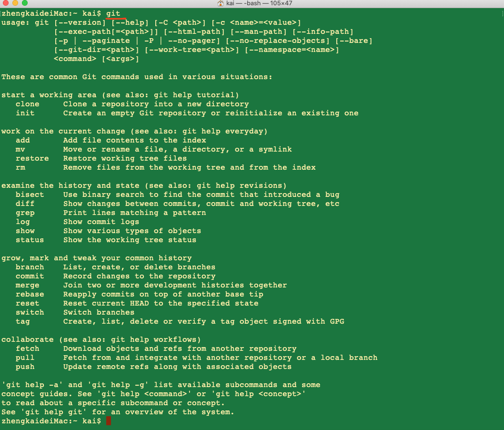

在「Git 的安装流程及步骤」一文中，我们已经把 Git 安装成功了，现在，就让我们一起体验 Git 的魅力吧！

不知道大家是否还记得，在 Git 安装完成的时候，我们曾在 Git Bash 中输入git命令进行测试，其返回的结果如下图所示：

如上图所示，其返回了很多关于 Git 的信息，其中就包括 Git 的常用命令，例如init、add、log和status等等。在 Git 中，所有的命令都是以git开头，例如，git init其作用就是初始一个 Git 仓库。

为了方便演示，我们先在/Users/kai目录下创建一个名为MyGithub的子目录，并在其中新建一个名为Readme.md的文件，接下来我们的 Git 操作都是基于此目录和文件的。

此外，在这里还要强调一点，那就是：在我们进行任何的git操作之前，我们都得先切换到 Git 的仓库目录。换言之，我们得到先进入到（我们定义的）Git 仓库的最顶层文件目录下，然后从此目录中进入 Git Bash，这样之后的操作才能顺利进行。如果是 Linux 操作系统，则可以直接cd到仓库目录。以博主为例，选择demo目录作为 Git 仓库，然后进入demo目录之中，点击鼠标右键，再选择Git Bash Here，即可打开 Git Bash 的命令行窗口。

如上图所示，Git 会自动定位到进入的位置，如我们选择的demo目录，这也是为什么我们需要先进入到 Git 仓库的最顶层目录下，然后再打开 Git Bash 的原因。下面，我们结合 Git 的常用命令演示一下 Git 的相关操作。

第 1 个命令：git status

在命令行窗口的光标处，输入git status命令，查看仓库的状态：

如上图所示，结果显示demo不是一个 Git 仓库，这是很正常的反应，因为我们还没有在计算机中声明demo为 Git 仓库，之前说demo是 Git 仓库只是我们口头上的说的，计算机当然不会认可。

第 2 个命令：git init

在命令行窗口的光标处，输入git init命令，初始化 Git 仓库：

如上图所示，结果显示已经初始化demo为一个空的 Git 仓库啦！在这里大家可以会有些疑问，因为我们在建立demo目录的同时也在里面新建了一个名为hit.txt的文件，怎么初始化仓库之后，demo目录就变成空的了呢？这个问题稍后解惑，我们重新输入git status命令检查一下仓库的状态：

如上图所示，在我们初始化仓库之后，demo目录已经成为一个 Git 仓库了，并且默认进入 Git 仓库的master分支，即主分支。在这里，我们需要注意的是Untracked fies提示，它表示demo仓库中有文件没有被追踪，并提示了具体没有被追踪的文件为hit.txt，还提示了我们可以使用git add命令操作这个文件，简直不要太好。

第 3 个命令：git add

在命令行窗口的光标处，输入git add hit.txt命令，将hit.txt文件添加到 Git 仓库：

如上图所示，如果没有报错，就说明命令已经执行啦！接下来，输入git status命令查看仓库状态：

如上图所示，已经显示Initial commit初始化提交了，同时已经没有Untracked files提示了，这说明文件hit.txt已经被添加到 Git 仓库了，而在我们没有进行git add操作之前，文件hit.txt并不被 Git 仓库认可，因此才会出现提示初始化仓库为空的现象。在这里，需要声明一点，那就是：git add命令并没有把文件提交到 Git 仓库，而是把文件添加到了「临时缓冲区」，这个命令有效防止了我们错误提交的可能性。

第 4 个命令：git commit

在命令行窗口的光标处，输入git commit -m "text commit"命令，将hit.txt文件提交到 Git 仓库：

如上图所示，我们成功将文件hit.txt提交到了 Git 仓库，其中commit表示提交，-m表示提交信息，提交信息写在双引号""内。接下来，再输入git status命令查看仓库状态：

如上图所示，结果显示nothing to commit, working tree clean，这表示已经没有内容可以提交了，即全部内容已经提交完毕。

第 5 个命令：git log

在命令行窗口的光标处，输入git log"命令，打印 Git 仓库提交日志：

如上图所示，显示了我们的提交记录，提交记录的内容包括Author提交作者、Date提交日期和提交信息。

通过以上的操作，我们会发现一个现象，那就是：在每个git操作之后，我们基本都会输入git status命令，查看仓库状态。这也从侧面说明了git status命令使用的频率之高，也建议大家在操作 Git 仓库的时候多使用git status命令，这能帮助我们实时了解仓库的状态，显然非常有用。

此外，不知道大家注没注意到：在提交记录的Author部分，显示了提交作者的名字guobinhit和提交作者的邮箱guobinhit@qq.com，不过这当然不是 Git 自动生成的啦，而是我事先进行了设置，具体如何设置，将在下一篇博文中介绍，还包括如何拉分支和合并分支等。

最后，附上博主的 GitHub 账号，欢迎大家 Follow：：[Tiren Wang](https://github.com/TirenWang)

------------------------------------------------

